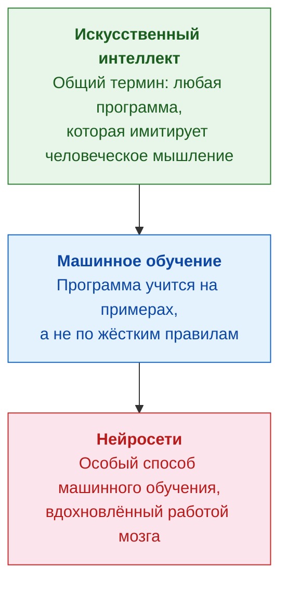
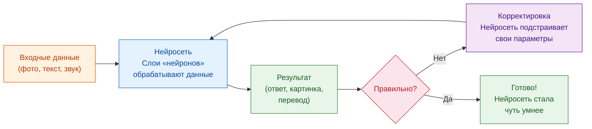
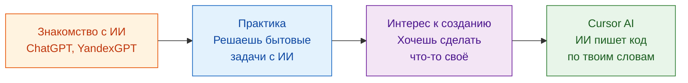

# Путешествие в мир искусственного интеллекта

> **Этот гайд** — для тех, кто слышал про «нейросети» и «ChatGPT», но пока не очень понимает, что это и зачем.
> Здесь всё объясняется простым языком, с примерами из обычной жизни.
> Никакого программирования не требуется — просто читай по порядку.

---

## Содержание

- [Что такое ИИ простыми словами](#что-такое-ии-простыми-словами)
- [Виды ИИ: от простого к сложному](#виды-ии-от-простого-к-сложному)
- [Как нейросеть учится — на пальцах](#как-нейросеть-учится--на-пальцах)
- [Какие нейросети бывают и что умеют](#какие-нейросети-бывают-и-что-умеют)
- [Как безопасно пользоваться ИИ в жизни](#как-безопасно-пользоваться-ии-в-жизни)
- [Практические примеры на каждый день](#практические-примеры-на-каждый-день)
- [Cursor AI — умный помощник для работы с кодом и текстом](#cursor-ai--умный-помощник-для-работы-с-кодом-и-текстом)
- [Учебный маршрут на 4 недели](#учебный-маршрут-на-4-недели)
- [Полезные ссылки](#полезные-ссылки)

---

## Что такое ИИ простыми словами

**Искусственный интеллект (ИИ)** — это программы, которые умеют делать вещи, для которых раньше нужен был человек: распознавать лица на фотографии, переводить текст, отвечать на вопросы, рисовать картинки.

Важно понимать: ИИ — это **не робот из фильмов**. Это просто очень умная математика внутри обычного компьютера или телефона.

> **Аналогия.** Представь калькулятор. Он не «думает» — он считает по правилам. ИИ — это как очень продвинутый калькулятор: вместо чисел он работает с текстом, картинками, звуком, но внутри всё равно — математика и правила. Просто правил очень-очень много, и он может «подстраивать» их сам.

### Зачем это обычному человеку?

- Голосовой помощник в телефоне (Алиса, Siri) — это ИИ.
- Переводчик Google/Яндекс — это ИИ.
- Фильтр спама в почте — это ИИ.
- Автоподбор маршрута в навигаторе — тоже ИИ.

Ты уже пользуешься ИИ, просто не знал об этом.

---

## Виды ИИ: от простого к сложному

Часто путают три понятия. Вот как они соотносятся:



| Термин | Что это | Пример из жизни |
|--------|---------|-----------------|
| **ИИ** (искусственный интеллект) | Любая «умная» программа | Шахматная программа на компьютере |
| **ML** (машинное обучение) | Программа, которая учится на данных | Рекомендации фильмов на Кинопоиске |
| **Нейросеть** | Особый вид ML, устроенный по образу мозга | ChatGPT, Midjourney, распознавание лиц |

> **Проще говоря:** все нейросети — это машинное обучение, всё машинное обучение — это ИИ. Но не каждый ИИ — нейросеть.

---

## Как нейросеть учится — на пальцах

Представь, что ты учишь ребёнка различать кошек и собак по фотографиям.

1. Показываешь ему 1000 фотографий кошек и 1000 фотографий собак, каждый раз говоря: «Это кошка», «Это собака».
2. Сначала он ошибается. Ты поправляешь.
3. Постепенно он начинает замечать: у кошек уши острые, у собак — морда длиннее.
4. Через какое-то время он уже сам определяет, кто на фото.

Нейросеть работает точно так же — только вместо ребёнка это программа, а вместо глаз — математические формулы.



> **Ключевая идея:** нейросеть не «знает» правильные ответы заранее. Она учится методом проб и ошибок на огромном количестве примеров — точно как человек, но гораздо быстрее.

---

## Какие нейросети бывают и что умеют

| Тип | Что делает | Примеры сервисов |
|-----|-----------|-----------------|
| **Текстовые (LLM)** | Пишут, отвечают, переводят, объясняют | ChatGPT, YandexGPT, Claude, GigaChat |
| **Генерация картинок** | Рисуют изображения по описанию | Midjourney, DALL-E, Kandinsky |
| **Распознавание речи** | Понимают голос и переводят в текст | Алиса, Siri, Google Voice |
| **Распознавание изображений** | Находят объекты на фото и видео | Google Lens, FaceID |
| **Музыка и звук** | Создают музыку, озвучку | Suno, ElevenLabs |

> **Совет для начала:** попробуй текстовые нейросети — они самые простые в использовании. Открой ChatGPT или YandexGPT в браузере и задай любой вопрос обычным языком.

---

## Как безопасно пользоваться ИИ в жизни

ИИ — мощный инструмент, но есть простые правила, чтобы не попасть впросак.

### Что стоит помнить

- **ИИ может ошибаться.** Он иногда выдумывает факты — это называют «галлюцинациями». Всегда перепроверяй важную информацию.
- **Не отправляй личные данные.** Паспорт, пароли, банковские реквизиты — этого ИИ знать не должен.
- **ИИ — помощник, не начальник.** Финальное решение всегда за тобой. Используй ИИ как «умного собеседника», а не как истину в последней инстанции.
- **Бесплатных версий достаточно для старта.** Не нужно сразу покупать подписки — начни с бесплатных тарифов.

### Простой чек-лист перед использованием

- [ ] Я не отправляю конфиденциальные данные
- [ ] Я перепроверю результат, если это важно
- [ ] Я понимаю, что ИИ может ошибаться
- [ ] Я использую официальный сайт сервиса, а не подозрительные ссылки

---

## Практические примеры на каждый день

| Задача | Что сказать ИИ | Какой сервис |
|--------|----------------|-------------|
| Написать поздравление | «Напиши тёплое поздравление коллеге с юбилеем» | ChatGPT, YandexGPT |
| Перевести документ | «Переведи этот текст на английский, сохрани деловой стиль» | ChatGPT, DeepL |
| Разобраться в документе | «Объясни простыми словами, что написано в этом договоре» | ChatGPT, Claude |
| Составить план поездки | «Составь маршрут на 3 дня по Казани с детьми, бюджет 30 тысяч» | ChatGPT, YandexGPT |
| Помочь с Excel | «Напиши формулу Excel, которая считает сумму ячеек A1:A10 только если значение больше 100» | ChatGPT, GigaChat |
| Проверить грамотность | «Проверь этот текст на ошибки и предложи улучшения» | ChatGPT, LanguageTool |

> **Главный принцип:** чем конкретнее ты описываешь задачу, тем лучше результат. Вместо «напиши текст» лучше «напиши деловое письмо поставщику с просьбой перенести срок поставки на 2 недели».

---

## Cursor AI — умный помощник для работы с кодом и текстом

### Что это такое

**Cursor** — это программа-редактор (как Word, только для кода и текстов), в которую встроен мощный ИИ-помощник. Ты пишешь задачу обычными словами, а ИИ помогает: дописывает, исправляет, объясняет, создаёт с нуля.

### Кому это полезно

- **Хочешь автоматизировать рутину** — ИИ напишет скрипт вместо тебя.
- **Хочешь сделать сайт или бота** — описываешь словами, Cursor пишет код.
- **Хочешь разобраться в чужом коде** — ИИ объяснит, что делает каждая строчка.
- **Не программист, но хочешь попробовать** — Cursor снижает порог входа в разы.

### Как это выглядит на практике

```
Ты: «Сделай таблицу в Excel, которая считает мои расходы по категориям»
Cursor: создаёт готовый файл с формулами и категориями

Ты: «Напиши бота для Telegram, который напоминает о днях рождения»
Cursor: пишет готовый код, объясняет как запустить

Ты: «Что делает эта программа? Объясни по шагам»
Cursor: разбирает код на понятные блоки с объяснениями
```

### Путь от новичка к Cursor



### Cursor: начало работы

1. Скачай Cursor с официального сайта [cursor.com](https://cursor.com).
2. Установи — это обычная программа, как любая другая.
3. Бесплатного тарифа хватит, чтобы попробовать.
4. Открой любую папку и начни задавать вопросы ИИ прямо в редакторе.

> **Оплата из России.** Если решишь перейти на платный тариф, из РФ удобно оплатить подписку Cursor через [plati.ru](https://plati.ru) — там продаются ключи активации. Это один из проверенных практических вариантов, когда прямая оплата картой недоступна.

---

## Учебный маршрут на 4 недели

| Неделя | Тема | Что делать |
|--------|------|-----------|
| **1** | Знакомство | Прочитай этот гайд. Зарегистрируйся в ChatGPT или YandexGPT. Задай 10 любых вопросов. |
| **2** | Практика | Решай реальные задачи: переводы, письма, планы. Попробуй загрузить фото и спросить «что здесь изображено?» |
| **3** | Углубление | Попробуй генерацию картинок (Kandinsky, DALL-E). Посмотри 2–3 видео на YouTube про нейросети простыми словами. |
| **4** | Cursor AI | Установи Cursor. Попроси ИИ сделать простую вещь: веб-страницу, табличку, скрипт. Не бойся экспериментировать. |

> **После 4 недель** ты будешь уверенно пользоваться ИИ-инструментами в повседневной жизни и работе, а при желании — создавать свои проекты с помощью Cursor.

---

## Полезные ссылки

| Ресурс | Зачем |
|--------|-------|
| [ChatGPT](https://chat.openai.com) | Главная текстовая нейросеть, бесплатный доступ |
| [YandexGPT](https://ya.ru/ai) | Российская нейросеть, хорошо понимает русский |
| [Claude](https://claude.ai) | Альтернатива ChatGPT, хороша для длинных текстов |
| [Cursor](https://cursor.com) | ИИ-редактор для кода и проектов |
| [Kandinsky](https://fusionbrain.ai) | Генерация картинок, работает из РФ |

---

<div align="center">

*Этот гайд создан, чтобы показать: ИИ — это не страшно и не сложно. Это просто новый инструмент, как когда-то интернет или смартфон. Попробуй — и увидишь сам.*

</div>
